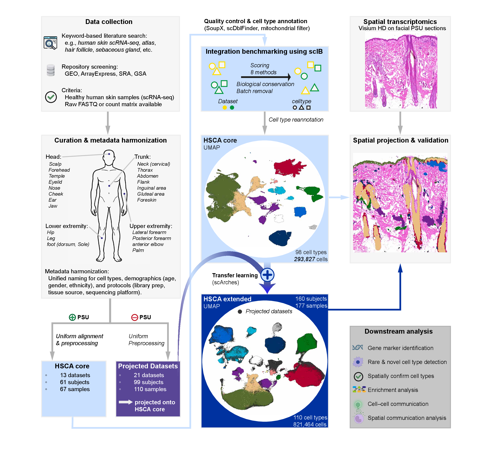

# The Human Skin Cell Atlas
**A comprehensive, integrated single-cell and spatial reference of healthy human skin.**

This repository contains analysis code, documentation and links to processed data for the **Human Skin Cell Atlas (HSCA)**. The HSCA integrates 34 public single-cell datasets (totaling 821,464 cells) with curated metadata and a harmonized cell type nomenclature. It combines scRNA-seq and Visium HD spatial transcriptomics to provide a high-resolution map of human skin architecture, with a particular focus on the pilosebaceous unit.

## Why a Human Skin Cell Atlas?
The skin is the body’s largest organ and plays essential roles in barrier protection, immune defense, sensory perception and repair. This complexity is mirrored in its diverse compartments, from the interfollicular epidermis to specialized appendages such as the **pilosebaceous unit (PSU)**, each with distinct roles in health and disease.

Most existing datasets focus on isolated regions, specific cell types, or limited donor cohorts. A **comprehensive, full-thickness reference** that integrates these fragmented resources has been missing. Advances in **single-cell and spatial transcriptomics** now make it possible to resolve skin organization at unprecedented depth, but meaningful insights require careful integration across donors, anatomical sites, and technologies.

The **HSCA** addresses this gap by harmonizing diverse datasets into a unified reference, complemented by high-resolution spatial transcriptomics. This resource enables:

- **Robust cell type annotation** across studies and datasets  
- **Spatial mapping** of key compartments such as the PSU  
- **Benchmarking** of organoids and in vitro models against in vivo tissue  
- **Foundations for disease research**, precision medicine, and regenerative approaches 
    

By providing an open, community resource, the HSCA establishes a reference framework for studying healthy human skin and accelerates discoveries in dermatology, immunology, and regenerative medicine.

## Study overview

The HSCA serves as a resource for the community by:

- **Constructing a HSCA core atlas** from curated and standardized PSU-containing datasets, capturing key PSU cell types across multiple samples.
- **Using transfer learning** to integrate 21 additional PSU-free datasets, resulting in the **extended HSCA**, a unified atlas spanning **160 subjects, 177 samples, 110 cell types, and over 800,000 cells**.
- **Combining single-cell and spatial transcriptomics** to capture both molecular identity and tissue architecture.
- **Discovering and validating rare cell populations**, such as Merkel cells, and refining PSU subtypes.
- **Examining library protocol effects** on cell type enrichment.
- **Providing benchmarking opportunities** for organoids and in vitro models against in vivo tissue.
- **Serving as a foundation for disease research**, enabling the study of perturbations in skin biology.

*Fig. 1: Study design HSCA.*

---
## Repository structure

The HSCA repository is organized as follows:

- `HSCA_code/` — Code to reproduce the HSCA  
  - `Build_HSCA/` — Scripts to build the atlas  
  - `Figures/` — Scripts for downstream analyses and manuscript figures

- `HSCA_data/` — Directories for storing and loading processed objects when running the HSCA code scripts  

- `docs/` — Supplementary tables with explanations  

- `envs/` — Docker files for reproducibility (TODO)  

- `configs/` — scIB configuration files 

- `figs/` — Study overview design and related figures   

- `LICENSE` — License information  

- `README` — Main documentation  

---

## Data Availability

- **Processed Seurat objects** are available on [Zenodo](https://doi.org/10.5281/zenodo.17088022).  
- **Raw sequencing data** will be deposited in [GEO](https://www.ncbi.nlm.nih.gov/geo/).  
- **Interactive exploration** of the processed data will be available via the [CellxGene browser](https://cellxgene.cziscience.com/). 

## See the HSCA manuscript

Düz et al., *bioRxiv* (2025) — [link to preprint](https://www.biorxiv.org/).  

Questions or comments? We welcome contributions and discussions via the GitHub Issues page.  
For direct inquiries, you can also reach me at: duez.tolga@gmail.com
